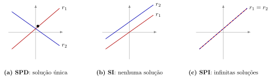

## Sumário {.smaller}

- **1.1** Equações e sistemas lineares — forma matricial $Ax=b$
- **1.2** Classificação: SPD, SPI, SI
- **1.3** Interpretação geométrica em $\mathbb{R}^2$
- **1.4** Interpretação geométrica em $\mathbb{R}^3$
- **1.5** Sistemas equivalentes — motivação para a eliminação de Gauss

# 1.1 — Equações e sistemas lineares

## Equação linear

::: {.callout-note title="Definição"}
Uma **equação linear** nas incógnitas $x_1,x_2,\dots,x_n$ tem a forma
$$a_1x_1+a_2x_2+\cdots+a_nx_n=b,$$
em que $a_1,\dots,a_n$ (coeficientes) e $b$ são números reais fixos.
:::

- Não há produtos entre incógnitas, nem potências ou funções transcendentais delas.
- Exemplo: $2x+3y=5$ é linear; $2x^2+3y=5$ e $2xy=5$ **não** são.

## Sistema de equações lineares

::: {.callout-note title="Definição"}
Um **sistema linear** com $m$ equações e $n$ incógnitas é um conjunto
$$
\begin{cases}
a_{11}x_1+a_{12}x_2+\cdots+a_{1n}x_n = b_1\\
a_{21}x_1+a_{22}x_2+\cdots+a_{2n}x_n = b_2\\
\qquad\vdots\\
a_{m1}x_1+a_{m2}x_2+\cdots+a_{mn}x_n = b_m
\end{cases}
$$
:::

Uma **solução** é uma $n$-upla $(x_1,\dots,x_n)$ que satisfaz **todas** as equações simultaneamente.

## Forma matricial $Ax=b$

Todo sistema linear se escreve de modo compacto como $Ax=b$:

$$
\underbrace{\begin{bmatrix}a_{11}&a_{12}&\cdots&a_{1n}\\a_{21}&a_{22}&\cdots&a_{2n}\\\vdots&&&\vdots\\a_{m1}&a_{m2}&\cdots&a_{mn}\end{bmatrix}}_{A\ (m\times n)}
\underbrace{\begin{bmatrix}x_1\\x_2\\\vdots\\x_n\end{bmatrix}}_{x\ (n\times 1)}
=
\underbrace{\begin{bmatrix}b_1\\b_2\\\vdots\\b_m\end{bmatrix}}_{b\ (m\times 1)}
$$

**Exemplo:** o sistema $\begin{cases}2x+3y=5\\4x-y=11\end{cases}$ tem forma matricial
$$\begin{bmatrix}2&3\\4&-1\end{bmatrix}\begin{bmatrix}x\\y\end{bmatrix}=\begin{bmatrix}5\\11\end{bmatrix}.$$

# 1.2 — Classificação de sistemas lineares

## SPD, SPI, SI

::: {.callout-note title="Definição"}
Quanto ao número de soluções, todo sistema linear é de exatamente um dos três tipos:

- **SPD** — Sistema Possível (compatível) e **D**eterminado: solução **única**.
- **SPI** — Sistema Possível e **I**ndeterminado: **infinitas** soluções.
- **SI** — Sistema **I**mpossível (incompatível): **nenhuma** solução.
:::

Resolver um sistema é, portanto, determinar em qual dessas três categorias ele se enquadra e, quando possível, descrever explicitamente o conjunto-solução.

## Exemplo — sistema SPD (resolução por substituição)

$$\begin{cases}x+y=5\\2x-y=1\end{cases}$$

Da primeira equação: $y=5-x$. Substituindo na segunda:
$$2x-(5-x)=1 \implies 3x-5=1 \implies x=2.$$

Logo $y=5-2=3$. **Verificação:** $2+3=5$ ✓, $\ 2(2)-3=1$ ✓.

$$\boxed{(x,y)=(2,3)} \quad \text{— solução única (SPD).}$$

## Exemplo — sistema SPI

$$\begin{cases}x+y=2\\2x+2y=4\end{cases}$$

A segunda equação é exatamente a primeira multiplicada por $2$ — **a mesma reta**. Da primeira equação, $y=2-x$: para **cada** valor de $x$ existe um $y$ correspondente.

$$\boxed{(x,y)=(t,\,2-t),\quad t\in\mathbb{R}} \quad \text{— infinitas soluções (SPI).}$$

$t$ é chamado **parâmetro** (ou variável livre).

## Exemplo — sistema SI

$$\begin{cases}x+2y=3\\2x+4y=9\end{cases}$$

Multiplicando a primeira equação por $2$: $2x+4y=6$. Mas a segunda equação exige $2x+4y=9$ — **contradição** ($6\neq 9$).

$$\boxed{\text{Conjunto-solução} = \varnothing} \quad \text{— nenhuma solução (SI).}$$

Geometricamente: as duas equações representam retas **paralelas e distintas**.

# 1.3 — Interpretação geométrica em $\mathbb{R}^2$

## Duas retas no plano

Cada equação linear em duas incógnitas representa uma **reta** em $\mathbb{R}^2$. A solução do sistema é a **interseção** dessas retas.

{fig-align="center" width="95%"}

## Correspondência sistema $\leftrightarrow$ retas

| Tipo | Posição das retas | Nº de soluções |
|---|---|---|
| **SPD** | concorrentes (um ponto comum) | $1$ |
| **SI** | paralelas e distintas | $0$ |
| **SPI** | coincidentes (a mesma reta) | $\infty$ |

- Os três exemplos numéricos anteriores ilustram exatamente esses três casos.
- Este raciocínio geométrico vale só para $n=2$ incógnitas; para $n\ge 3$ precisamos de álgebra (eliminação) para "enxergar" a solução.

# 1.4 — Interpretação geométrica em $\mathbb{R}^3$

## Três planos no espaço

Uma equação linear em três incógnitas, $a_1x+a_2y+a_3z=b$, representa um **plano** em $\mathbb{R}^3$. Um sistema $3\times 3$ corresponde à interseção de **três planos**.

- **SPD:** os três planos se encontram em um **único ponto**.
- **SPI:** os planos se encontram ao longo de uma **reta comum** (ou coincidem em um **plano comum**) — infinitas soluções.
- **SI:** não há ponto comum aos três — por exemplo, dois planos paralelos, ou três planos que se cruzam dois a dois em retas paralelas distintas (formando um "prisma"), sem ponto em comum.

::: {.callout-tip title="Observação"}
Diferentemente do caso $2\times2$, em $\mathbb{R}^3$ a visualização geométrica direta é mais difícil — por isso, a partir de três incógnitas, o método algébrico (eliminação de Gauss, próxima aula) é a ferramenta padrão para classificar e resolver o sistema.
:::

# 1.5 — Sistemas equivalentes e operações elementares

## Sistemas equivalentes

::: {.callout-note title="Definição"}
Dois sistemas lineares são **equivalentes** quando possuem exatamente o mesmo conjunto-solução.
:::

::: {.callout-important title="Ideia central"}
Certas operações transformam um sistema em outro **equivalente** (mesmas soluções), mas com aparência mais simples — essa é a base do método de eliminação de Gauss (Aula 3):

1. **Trocar** a ordem de duas equações.
2. **Multiplicar** uma equação por uma constante não nula.
3. **Somar** a uma equação um múltiplo de outra.
:::

Essas três operações não criam nem destroem soluções — apenas reescrevem o sistema de forma mais conveniente para "isolar" as incógnitas.

## Exemplo — sistema $3\times3$ resolvido

$$\begin{cases}x+y+z=6\\2x-y+z=3\\x+2y-z=2\end{cases}$$

Da 1ª equação: $x=6-y-z$. Substituindo na 2ª e na 3ª:

$$2(6-y-z)-y+z=3 \ \Rightarrow\ -3y-z=-9 \ \Rightarrow\ 3y+z=9$$
$$(6-y-z)+2y-z=2 \ \Rightarrow\ y-2z=-4$$

## Exemplo — sistema $3\times3$ resolvido (continuação)

Do par restante $\begin{cases}3y+z=9\\y-2z=-4\end{cases}$: isolando $z=9-3y$ e substituindo,

$$y-2(9-3y)=-4 \ \Rightarrow\ 7y=14 \ \Rightarrow\ y=2.$$

Logo $z=9-3(2)=3$ e $x=6-2-3=1$.

**Verificação:** $1+2+3=6$ ✓, $\ 2(1)-2+3=3$ ✓, $\ 1+2(2)-3=2$ ✓.

$$\boxed{(x,y,z)=(1,2,3)} \quad \text{— SPD.}$$

## Resumo da aula {.smaller}

- **1.1** — Equação e sistema linear; forma matricial $Ax=b$.
- **1.2** — Classificação SPD (única solução) / SPI (infinitas) / SI (nenhuma).
- **1.3** — Em $\mathbb{R}^2$: retas concorrentes, paralelas ou coincidentes.
- **1.4** — Em $\mathbb{R}^3$: interseção de três planos; visualização mais difícil.
- **1.5** — Operações elementares geram sistemas equivalentes — base da eliminação de Gauss (próxima aula).

## Referências

- **Anton, H. & Rorres, C.** *Álgebra Linear com Aplicações*, 10ª ed., Bookman — Cap. 1.
- **Lay, D. C.** *Álgebra Linear e suas Aplicações*, 4ª ed., Pearson — Cap. 1.
- **Strang, G.** *Introdução à Álgebra Linear*, 4ª ed., LTC — Cap. 1.
