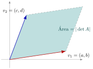

## Sumário {.smaller}

- **7.1** Determinante $2\times2$ e $3\times3$ (regra de Sarrus)
- **7.2** Interpretação geométrica: área e volume
- **7.3** Expansão em cofatores (Laplace)
- **7.4** Propriedades dos determinantes
- **7.5** Determinante e invertibilidade

# 7.1 — Determinante de matrizes $2\times2$ e $3\times3$

## Determinante $2\times2$

::: {.callout-note title="Definição"}
Para $A=\begin{bmatrix}a&b\\c&d\end{bmatrix}$:
$$\det A = ad-bc$$
:::

**Exemplo:** $A=\begin{bmatrix}3&2\\1&4\end{bmatrix} \ \Rightarrow\ \det A = 3(4)-2(1)=10.$

## Determinante $3\times3$ — regra de Sarrus

::: {.callout-note title="Regra de Sarrus"}
Repetindo as duas primeiras colunas à direita, some os produtos das três diagonais "descendentes" e subtraia os produtos das três diagonais "ascendentes".
:::

**Exemplo:** $A=\begin{bmatrix}1&2&3\\0&1&4\\5&6&0\end{bmatrix}$

$$\det A = \big[1(1)(0)+2(4)(5)+3(0)(6)\big] - \big[3(1)(5)+1(4)(6)+2(0)(0)\big]$$
$$= (0+40+0)-(15+24+0) = 40-39 = 1$$

# 7.2 — Interpretação geométrica

## Determinante como área / volume

{fig-align="center" width="50%"}

::: {.callout-tip title="Interpretação geométrica"}
- Em $\mathbb{R}^2$: $|\det[v_1\ v_2]|$ = área do paralelogramo formado pelos vetores-coluna $v_1,v_2$.
- Em $\mathbb{R}^3$: $|\det[v_1\ v_2\ v_3]|$ = volume do paralelepípedo formado por $v_1,v_2,v_3$.
:::

- Se $\det A=0$: os vetores são **colineares/coplanares** — a "figura" degenera (área/volume nulo).

# 7.3 — Expansão em cofatores (Laplace)

## Menor complementar e cofator

::: {.callout-note title="Definição"}
Para $A$ ($n\times n$), o **menor complementar** $M_{ij}$ é o determinante da submatriz $(n-1)\times(n-1)$ obtida ao remover a linha $i$ e a coluna $j$ de $A$. O **cofator** é
$$C_{ij}=(-1)^{i+j}M_{ij}.$$
:::

::: {.callout-important title="Teorema — expansão de Laplace"}
Para qualquer linha $i$ (ou coluna $j$) fixada:
$$\det A = \sum_{k=1}^n a_{ik}C_{ik} = \sum_{k=1}^n a_{kj}C_{kj}$$
:::

- Válido ao longo de **qualquer** linha ou coluna — o resultado é sempre o mesmo.

## Exemplo — expansão por cofatores (linha 2)

Para $A=\begin{bmatrix}1&2&3\\0&1&4\\5&6&0\end{bmatrix}$, expandindo pela **linha 2** ($a_{21}=0,\ a_{22}=1,\ a_{23}=4$):

$$C_{21}=(-1)^{3}\begin{vmatrix}2&3\\6&0\end{vmatrix}=-\big(0-18\big)=18$$
$$C_{22}=(-1)^{4}\begin{vmatrix}1&3\\5&0\end{vmatrix}=\big(0-15\big)=-15$$
$$C_{23}=(-1)^{5}\begin{vmatrix}1&2\\5&6\end{vmatrix}=-\big(6-10\big)=4$$

$$\det A = 0(18)+1(-15)+4(4) = -15+16 = 1$$

Confere com o valor obtido por Sarrus.

# 7.4 — Propriedades dos determinantes

## Matriz triangular e troca de linhas

::: {.callout-important title="Propriedade 1 — matriz triangular"}
Se $A$ é triangular (superior ou inferior), $\det A$ é o **produto dos elementos da diagonal**.
:::

**Exemplo:** $U=\begin{bmatrix}2&1&1\\0&-8&-2\\0&0&1\end{bmatrix}$ (Aula 6) $\ \Rightarrow\ \det U = 2(-8)(1)=-16.$

::: {.callout-important title="Propriedade 2 — troca de linhas"}
Trocar duas linhas de $A$ **inverte o sinal** do determinante.
:::

**Exemplo:** $\begin{vmatrix}3&2\\1&4\end{vmatrix}=10$, mas $\begin{vmatrix}1&4\\3&2\end{vmatrix}=2-12=-10.$

## Linhas nulas, proporcionais e operações elementares

::: {.callout-important title="Propriedades 3, 4 e 5"}
3. Se $A$ possui uma linha (ou coluna) nula, $\det A = 0$.
4. Se duas linhas (ou colunas) de $A$ são proporcionais, $\det A = 0$.
5. Somar a uma linha um múltiplo de outra **não altera** o determinante.
:::

**Exemplo (prop. 4):** $\begin{vmatrix}1&2\\2&4\end{vmatrix}=4-4=0$ (linha 2 = 2×linha 1).

**Exemplo (prop. 5):** $\begin{vmatrix}1&2\\3&4\end{vmatrix}=-2$; somando $2L_1$ a $L_2$: $\begin{vmatrix}1&2\\5&8\end{vmatrix}=8-10=-2.$ Mesmo valor!

## Produto, transposta e múltiplo escalar

::: {.callout-important title="Propriedades 6, 7 e 8"}
6. $\det(AB) = \det(A)\det(B)$
7. $\det(A^T) = \det(A)$
8. $\det(cA) = c^n\det(A)$, para $A$ de tamanho $n\times n$
:::

**Exemplo (prop. 6):** $A=\begin{bmatrix}1&2\\0&1\end{bmatrix}$ ($\det A=1$), $B=\begin{bmatrix}2&0\\1&3\end{bmatrix}$ ($\det B=6$): $AB=\begin{bmatrix}4&6\\1&3\end{bmatrix}$, $\det(AB)=12-6=6=1\times6$ ✓

**Exemplo (prop. 8):** $A=\begin{bmatrix}1&2\\3&4\end{bmatrix}$ ($\det A=-2$, $n=2$): $2A=\begin{bmatrix}2&4\\6&8\end{bmatrix}$, $\det(2A)=16-24=-8=2^2(-2)$ ✓

# 7.5 — Determinante e invertibilidade

## $A$ invertível $\iff$ $\det(A)\neq0$

::: {.callout-important title="Teorema"}
Uma matriz quadrada $A$ é invertível se, e somente se, $\det(A)\neq0$. Além disso,
$$\det(A^{-1}) = \frac{1}{\det(A)}.$$
:::

**Exemplo:** $A=\begin{bmatrix}2&1\\1&1\end{bmatrix}$ (Aula 5): $\det A = 2(1)-1(1)=1\neq0 \ \Rightarrow\ A$ é invertível.

Com $A^{-1}=\begin{bmatrix}1&-1\\-1&2\end{bmatrix}$: $\det(A^{-1})=1(2)-(-1)(-1)=2-1=1=\dfrac{1}{\det A}=\dfrac11.$ ✓

- Este critério completa a lista de equivalências da Aula 5: invertibilidade $\iff$ posto completo $\iff$ $Ax=0$ só trivial $\iff$ $\det(A)\neq0$.

## Resumo da aula {.smaller}

- **7.1** — Determinante $2\times2$: $ad-bc$; $3\times3$: regra de Sarrus.
- **7.2** — $|\det|$ mede área ($\mathbb{R}^2$) ou volume ($\mathbb{R}^3$) formado pelos vetores-coluna.
- **7.3** — Expansão de Laplace: $\det A=\sum_k a_{ik}C_{ik}$, válida ao longo de qualquer linha/coluna.
- **7.4** — Triangular: produto da diagonal; troca de linha inverte sinal; linha nula/proporcional $\Rightarrow$ $\det=0$; $\det(AB)=\det A\det B$; $\det(A^T)=\det A$; $\det(cA)=c^n\det A$.
- **7.5** — $A$ invertível $\iff \det(A)\neq0$; $\det(A^{-1})=1/\det(A)$.

## Referências

- **Anton, H. & Rorres, C.** *Álgebra Linear com Aplicações*, 10ª ed., Bookman — Cap. 2.
- **Lay, D. C.** *Álgebra Linear e suas Aplicações*, 4ª ed., Pearson — Cap. 3.
- **Strang, G.** *Introdução à Álgebra Linear*, 4ª ed., LTC — Cap. 5.
