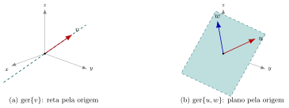

## Sumário {.smaller}

- **10.1** Definição de subespaço e teste de subespaço
- **10.2** Exemplos geométricos em $\mathbb{R}^3$
- **10.3** Exemplos em espaços de matrizes
- **10.4** Espaço-solução de sistemas lineares
- **10.5** Interseção e união de subespaços

# 10.1 — Definição

## Subespaço vetorial

::: {.callout-note title="Definição"}
Seja $V$ espaço vetorial. Um subconjunto $W\subseteq V$, $W\neq\emptyset$, é um **subespaço** de $V$ quando $W$ é fechado sob as operações de $V$:

- $u,v\in W \Rightarrow u+v\in W$
- $u\in W,\ c$ escalar $\Rightarrow cu\in W$
:::

- Como $W$ herda as operações de $V$, os axiomas 2,3,7,8,9,10 são automáticos.
- Só é preciso checar: fechamento, existência do vetor nulo e dos opostos — e estes últimos decorrem do fechamento (Teorema a seguir).

## Teste do subespaço

::: {.callout-important title="Teorema — teste de subespaço"}
$W\subseteq V$ é subespaço de $V$ se, e somente se, valem as **três** condições:

1. $0\in W$ (o vetor nulo pertence a $W$);
2. $u,v\in W \Rightarrow u+v\in W$ (fechado sob adição);
3. $u\in W,\ c\in\mathbb{R} \Rightarrow cu\in W$ (fechado sob escalar).
:::

- Todo subespaço é, ele próprio, um espaço vetorial (com as mesmas operações de $V$).
- Todo espaço vetorial $V$ tem pelo menos dois subespaços "triviais": $\{0\}$ e o próprio $V$.

# 10.2 — Exemplos geométricos em $\mathbb{R}^3$

## Retas e planos pela origem

{fig-align="center" width="85%"}

- Uma **reta pela origem** é $W=\{tv : t\in\mathbb{R}\}$ para algum $v\neq0$ — é o espaço gerado por $v$.
- Um **plano pela origem** é $W=\{su+tw : s,t\in\mathbb{R}\}$ para $u,w$ não colineares.
- Ambos satisfazem o teste do subespaço (contêm $0$, e são fechados sob soma e escalar).

## Retas e planos que NÃO passam pela origem

::: {.callout-tip title="Contraexemplo"}
Seja $W=\{(x,y,1) : x,y\in\mathbb{R}\}$ — plano $z=1$ em $\mathbb{R}^3$, que **não** passa pela origem.

- $0=(0,0,0)\notin W$: já falha a condição 1 do teste.
- Também falha o fechamento: $(1,0,1)\in W$, mas $2\cdot(1,0,1)=(2,0,2)\notin W$.

Logo $W$ **não é** subespaço de $\mathbb{R}^3$ — apesar de ser um plano "geometricamente bonito".
:::

- **Regra geral:** todo subespaço não trivial de $\mathbb{R}^3$ é $\{0\}$, uma reta pela origem, um plano pela origem, ou $\mathbb{R}^3$.

# 10.3 — Exemplos em espaços de matrizes

## Matrizes simétricas formam subespaço

Seja $W=\{A\in M_{n,n} : A^T=A\}\subset M_{n,n}$.

- $0\in W$: a matriz nula é simétrica.
- Fechado sob soma: se $A^T=A$ e $B^T=B$, então $(A+B)^T = A^T+B^T = A+B$.
- Fechado sob escalar: $(cA)^T = cA^T = cA$.

$\Rightarrow$ $W$ **é** subespaço de $M_{n,n}$.

## Matrizes invertíveis NÃO formam subespaço

::: {.callout-tip title="Contraexemplo"}
Seja $W=\{A\in M_{2,2} : A \text{ é invertível}\}$. Tome
$$A=\begin{bmatrix}1&0\\0&1\end{bmatrix}, \qquad B=\begin{bmatrix}-1&0\\0&-1\end{bmatrix}$$

Ambas são invertíveis ($\det A=1\neq0$, $\det B=1\neq0$), mas
$$A+B=\begin{bmatrix}0&0\\0&0\end{bmatrix}$$
que **não é invertível** ($\det=0$). Logo $W$ não é fechado sob adição: **não é** subespaço.
:::

- Além disso, $0\notin W$ (a matriz nula nunca é invertível) — já bastaria para falhar o teste.

# 10.4 — Espaço-solução de sistemas lineares

## O espaço-solução de $Ax=0$ é subespaço

Seja $A$ matriz $m\times n$ e $N(A)=\{x\in\mathbb{R}^n : Ax=0\}$ (o **núcleo**, visto em AL04).

::: {.callout-important title="Teorema"}
$N(A)$ é subespaço de $\mathbb{R}^n$.
:::

**Verificação do teste:**

1. $A\cdot 0 = 0 \Rightarrow 0\in N(A)$.
2. Se $Ax=0$ e $Ay=0$, então $A(x+y)=Ax+Ay=0+0=0 \Rightarrow x+y\in N(A)$.
3. Se $Ax=0$, então $A(cx)=c(Ax)=c\cdot0=0 \Rightarrow cx\in N(A)$.

## O espaço-solução de $Ax=b$ ($b\neq0$) NÃO é subespaço

::: {.callout-tip title="Contraexemplo"}
Seja $S=\{x\in\mathbb{R}^n : Ax=b\}$ com $b\neq 0$.

- Se $x_0\in S$, então $A(0)=0\neq b$, logo $0\notin S$.
- Já falha a condição 1 do teste $\Rightarrow$ $S$ **não é** subespaço (é um conjunto "deslocado" — um hiperplano afim, não pela origem).
:::

- Geometricamente: análogo às retas/planos que não passam pela origem da seção 10.2.

# 10.5 — Interseção e união de subespaços

## Interseção de subespaços é subespaço

::: {.callout-important title="Teorema"}
Se $W_1,W_2$ são subespaços de $V$, então $W_1\cap W_2$ também é subespaço de $V$.
:::

**Prova (teste de subespaço):**

1. $0\in W_1$ e $0\in W_2$ (ambos subespaços) $\Rightarrow 0\in W_1\cap W_2$.
2. Se $u,v\in W_1\cap W_2$: $u,v\in W_1\Rightarrow u+v\in W_1$; $u,v\in W_2\Rightarrow u+v\in W_2$. Logo $u+v\in W_1\cap W_2$.
3. Analogamente, $u\in W_1\cap W_2,\ c$ escalar $\Rightarrow cu\in W_1$ e $cu\in W_2 \Rightarrow cu\in W_1\cap W_2$. $\blacksquare$

## União de subespaços em geral NÃO é subespaço

::: {.callout-tip title="Contraexemplo"}
Em $\mathbb{R}^2$: $W_1=\{(x,0):x\in\mathbb{R}\}$ (eixo $x$) e $W_2=\{(0,y):y\in\mathbb{R}\}$ (eixo $y$) — ambos subespaços.

Tome $u=(1,0)\in W_1\subset W_1\cup W_2$ e $v=(0,1)\in W_2\subset W_1\cup W_2$. Mas
$$u+v = (1,1) \notin W_1\cup W_2$$

pois $(1,1)$ não está em nenhum dos eixos. Logo $W_1\cup W_2$ **não é fechada sob adição**: não é subespaço.
:::

## Resumo da aula

- **10.1** — Subespaço: subconjunto não vazio fechado sob soma e escalar; teste com 3 condições ($0\in W$, fechamento da soma, fechamento do escalar).
- **10.2** — Em $\mathbb{R}^3$: retas/planos **pela origem** são subespaços; se não passam pela origem, não são.
- **10.3** — Matrizes simétricas: subespaço de $M_{n,n}$. Matrizes invertíveis: **não** formam subespaço.
- **10.4** — $N(A)=\{x:Ax=0\}$ é subespaço; $\{x:Ax=b\}$ com $b\neq0$ não é.
- **10.5** — Interseção de subespaços é subespaço; união em geral não é.

## Referências

- ANTON, H.; RORRES, C. **Álgebra Linear com Aplicações**. 10ª ed. Seção 4.2 — Subespaços.
- LAY, D. **Álgebra Linear e suas Aplicações**. 4ª ed. Seção 4.1 — Espaços Vetoriais e Subespaços.
- STRANG, G. **Álgebra Linear e suas Aplicações**. 4ª ed. Seção 3.1 — Espaços Vetoriais e Subespaços.
