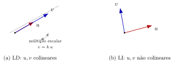

## Sumário {.smaller}

- **12.1** Definição de dependência e independência linear
- **12.2** Interpretação geométrica
- **12.3** Método prático: matriz e escalonamento
- **12.4** Exemplo numérico completo
- **12.5** Dois teoremas úteis

# 12.1 — Definição

## Dependência e independência linear

::: {.callout-note title="Definição"}
Um conjunto $\{v_1,v_2,\ldots,v_k\}\subset V$ é **linearmente dependente (LD)** se existem escalares $c_1,\ldots,c_k$, **não todos nulos**, tais que
$$c_1v_1+c_2v_2+\cdots+c_kv_k = 0.$$

Caso contrário — isto é, se a **única** solução da equação acima for $c_1=c_2=\cdots=c_k=0$ (a solução **trivial**) — o conjunto é **linearmente independente (LI)**.
:::

- LD: existe uma relação de dependência não trivial entre os vetores.
- LI: nenhum vetor do conjunto pode ser escrito como combinação linear dos demais.

# 12.2 — Interpretação geométrica

## LD e LI em $\mathbb{R}^2$/$\mathbb{R}^3$

{fig-align="center" width="85%"}

- **(a)** Dois vetores são **LD** $\iff$ são **paralelos/colineares** ($v=ku$ para algum escalar $k$).
- **(b)** Dois vetores são **LI** $\iff$ **não** são colineares.
- Em $\mathbb{R}^3$: três vetores são **LD** $\iff$ são **coplanares** (todos contidos em um mesmo plano pela origem).

# 12.3 — Método prático

## Testando LI/LD via escalonamento

Para testar se $\{v_1,\ldots,v_k\}\subset\mathbb{R}^n$ é LI:

1. Monte a matriz $M$ com $v_1,\ldots,v_k$ como **colunas**.
2. Escalone $M$ até a forma escalonada.
3. Compare o **posto** de $M$ com o número $k$ de vetores.

::: {.callout-important title="Teorema"}
$\{v_1,\ldots,v_k\}$ é LI $\iff$ $\mathrm{posto}(M)=k$ $\iff$ o sistema homogêneo $Mc=0$ tem **só** a solução trivial.
:::

- Se $k=n$ (mesmo número de vetores que a dimensão do espaço), basta calcular $\det(M)$: LI $\iff \det(M)\neq0$.

# 12.4 — Exemplo numérico completo

## Testando LI/LD de três vetores em $\mathbb{R}^3$

Sejam $v_1=(1,2,3)$, $v_2=(0,1,4)$, $v_3=(2,3,2)$. Montamos $M$ com essas colunas e escalonamos:

$$M=\begin{bmatrix}1&0&2\\2&1&3\\3&4&2\end{bmatrix} \xrightarrow{L_2-2L_1,\ L_3-3L_1} \begin{bmatrix}1&0&2\\0&1&-1\\0&4&-4\end{bmatrix} \xrightarrow{L_3-4L_2} \begin{bmatrix}1&0&2\\0&1&-1\\0&0&0\end{bmatrix}$$

$\mathrm{posto}(M)=2 < 3 = k$ (número de vetores) $\Rightarrow$ **LD**.

## Encontrando a relação de dependência

Resolvendo $c_1v_1+c_2v_2+c_3v_3=0$ a partir da forma escalonada ($c_3=t$ livre):
$$c_1+2c_3=0 \Rightarrow c_1=-2t, \qquad c_2-c_3=0 \Rightarrow c_2=t$$

Para $t=1$: $c_1=-2$, $c_2=1$, $c_3=1$. Verificando:
$$-2v_1+v_2+v_3 = -2(1,2,3)+(0,1,4)+(2,3,2) = (0,0,0) \ \checkmark$$

Ou seja, $v_3 = 2v_1-v_2$: o terceiro vetor é combinação linear dos outros dois.

# 12.5 — Dois teoremas úteis

## Mais vetores que a dimensão

::: {.callout-important title="Teorema"}
Todo conjunto com mais de $n$ vetores em $\mathbb{R}^n$ é **linearmente dependente**.
:::

- Intuição: a equação $c_1v_1+\cdots+c_kv_k=0$ (com $k>n$) é um sistema homogêneo de $n$ equações e $k>n$ incógnitas — sempre tem solução não trivial (mais incógnitas que equações).
- Exemplo: quaisquer 4 vetores em $\mathbb{R}^3$ são automaticamente LD.

## Conjunto contendo o vetor nulo

::: {.callout-important title="Teorema"}
Todo conjunto que contém o vetor nulo é **linearmente dependente**.
:::

**Justificativa:** se $v_1=0$, então $1\cdot v_1 + 0\cdot v_2+\cdots+0\cdot v_k = 0$ é uma combinação **não trivial** (o coeficiente de $v_1$ é $1\neq0$) que resulta em $0$.

- Logo, um conjunto LI **nunca** pode conter o vetor nulo.

## Resumo da aula

- **12.1** — LD: existe combinação linear não trivial igual a zero. LI: só a trivial.
- **12.2** — Geometricamente: LD $\iff$ colinear (2 vetores) ou coplanar (3 vetores em $\mathbb{R}^3$).
- **12.3** — Método prático: matriz com vetores em colunas, escalonar; LI $\iff$ posto = número de vetores.
- **12.4** — Exemplo completo: $\{(1,2,3),(0,1,4),(2,3,2)\}$ é LD, com $v_3=2v_1-v_2$.
- **12.5** — Mais de $n$ vetores em $\mathbb{R}^n$: sempre LD. Conjunto com o vetor nulo: sempre LD.

## Referências

- ANTON, H.; RORRES, C. **Álgebra Linear com Aplicações**. 10ª ed. Seção 4.3 — Independência Linear.
- LAY, D. **Álgebra Linear e suas Aplicações**. 4ª ed. Seção 4.3 — Conjuntos Linearmente Independentes; Bases.
- STRANG, G. **Álgebra Linear e suas Aplicações**. 4ª ed. Seção 3.1 — Independência Linear.
