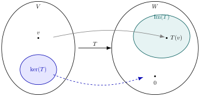

## Sumário {.smaller}

- **17.1** Núcleo e imagem: definições e primeiras propriedades
- **17.2** Conexão com os espaços fundamentais de uma matriz
- **17.3** Nulidade, posto e o Teorema do Núcleo e da Imagem
- **17.4** Exemplo numérico completo

# 17.1 — Núcleo e Imagem

## Definições

::: {.callout-note title="Definição — Núcleo"}
Seja $T:V\to W$ linear. O **núcleo** de $T$ é
$$\ker(T) = \{v\in V : T(v) = 0\} \ \subset V$$
:::

::: {.callout-note title="Definição — Imagem"}
A **imagem** de $T$ é
$$\mathrm{Im}(T) = \{T(v) : v\in V\} \ \subset W$$
:::

## Núcleo e imagem são subespaços

::: {.callout-important title="Teorema"}
Se $T:V\to W$ é linear, então:

1. $\ker(T)$ é subespaço de $V$;
2. $\mathrm{Im}(T)$ é subespaço de $W$.
:::

- Ambos contêm o vetor nulo, pois $T(0)=0$ (Aula 16).
- Fechamento sob soma e escala decorre diretamente da linearidade de $T$: se $T(u)=T(v)=0$, então $T(u+v)=T(u)+T(v)=0$ e $T(cu)=cT(u)=0$; analogamente para a imagem.

# 17.2 — Conexão com os espaços fundamentais

## Se $T(x)=Ax$: núcleo e imagem via $N(A)$ e $R(A)$

Se $T:\mathbb{R}^n\to\mathbb{R}^m$ tem matriz canônica $A$ (Aula 16), então:

$$\ker(T) = \{x : Ax=0\} = N(A) \qquad \text{(espaço nulo de } A\text{)}$$

$$\mathrm{Im}(T) = \{Ax : x\in\mathbb{R}^n\} = R(A) \qquad \text{(espaço-coluna de } A\text{)}$$

- Tudo que já sabemos sobre $N(A)$ e $R(A)$ (Aula 14) se aplica diretamente ao núcleo e à imagem de $T$: para calcular $\ker(T)$, resolvemos $Ax=0$; para calcular $\mathrm{Im}(T)$, encontramos uma base do espaço gerado pelas colunas de $A$.

# 17.3 — Nulidade, posto e o Teorema do Núcleo e da Imagem

## Nulidade e posto de uma transformação linear

::: {.callout-note title="Definição"}
$$\text{nulidade}(T) = \dim\ker(T), \qquad \mathrm{posto}(T) = \dim\mathrm{Im}(T)$$
:::

::: {.callout-important title="Teorema do Núcleo e da Imagem"}
Se $T:V\to W$ é linear e $\dim V$ é finita, então
$$\dim\ker(T) + \dim\mathrm{Im}(T) = \dim V$$
:::

## Transformações injetoras e sobrejetoras

{fig-align="center" width="70%"}

::: {.callout-note title="Definições"}
$T$ é **injetora** quando $\ker(T)=\{0\}$ (nenhum vetor não nulo é levado a zero).

$T$ é **sobrejetora** quando $\mathrm{Im}(T) = W$.
:::

## Casos especiais em dimensão finita

- Se $\dim V = \dim W = n$ (finita): pelo Teorema do Núcleo e da Imagem, $\dim\ker T = 0 \iff \dim\mathrm{Im}\,T = n$. Logo
$$T \text{ injetora} \iff T \text{ sobrejetora} \iff T \text{ bijetora (isomorfismo)}$$
- Se $\dim V > \dim W$: $T$ **nunca** pode ser injetora.
- Se $\dim V < \dim W$: $T$ **nunca** pode ser sobrejetora.

# 17.4 — Exemplo completo

## Exemplo — a transformação e sua matriz

Seja $T:\mathbb{R}^3\to\mathbb{R}^3$, $T(x)=Ax$, com
$$A = \begin{bmatrix}1&2&-1\\2&4&1\\1&2&2\end{bmatrix}$$

Vamos calcular $\ker(T)$, $\mathrm{Im}(T)$, e classificar $T$ quanto à injetividade e sobrejetividade.

## Exemplo — cálculo do núcleo

Escalonando $[A\mid 0]$:
$$\begin{bmatrix}1&2&-1\\2&4&1\\1&2&2\end{bmatrix} \xrightarrow[L_3-L_1]{L_2-2L_1} \begin{bmatrix}1&2&-1\\0&0&3\\0&0&3\end{bmatrix}\xrightarrow{L_3-L_2}\begin{bmatrix}1&2&-1\\0&0&3\\0&0&0\end{bmatrix}$$

Da 2ª linha: $3x_3=0 \Rightarrow x_3=0$. Da 1ª linha: $x_1=-2x_2$. Com $x_2=t$ livre:
$$\ker(T) = \{\,t(-2,1,0)\ :\ t\in\mathbb{R}\,\} = \mathrm{span}\{(-2,1,0)\}$$

$\dim\ker(T)=1$ (nulidade $=1$).

## Exemplo — cálculo da imagem

As colunas de $A$ são $(1,2,1)$, $(2,4,2)$ e $(-1,1,2)$. Como a coluna $2$ é $2\times$ a coluna $1$, o espaço-coluna é gerado pelas colunas $1$ e $3$, que são linearmente independentes:
$$\mathrm{Im}(T) = \mathrm{span}\{(1,2,1),\ (-1,1,2)\}$$

$\dim\mathrm{Im}(T) = 2$ (posto $=2$).

**Verificação (Teorema do Núcleo e da Imagem):**
$$\dim\ker(T)+\dim\mathrm{Im}(T) = 1+2 = 3 = \dim\mathbb{R}^3 \ \checkmark$$

## Exemplo — classificação

- $\ker(T)\neq\{0\}$ $\ \Rightarrow\ $ $T$ **não é injetora**.
- $\dim\mathrm{Im}(T) = 2 < 3 = \dim\mathbb{R}^3$ $\ \Rightarrow\ $ $T$ **não é sobrejetora**.

## Resumo da aula {.smaller}

- **17.1** — $\ker(T)$ e $\mathrm{Im}(T)$ são subespaços de $V$ e $W$, respectivamente.
- **17.2** — Se $T(x)=Ax$: $\ker(T)=N(A)$ e $\mathrm{Im}(T)=R(A)$.
- **17.3** — Nulidade $+$ posto $=\dim V$; injetora $\iff \ker T=\{0\}$; sobrejetora $\iff \mathrm{Im}\,T = W$; em dimensões iguais, injetora $\iff$ sobrejetora.
- **17.4** — Exemplo com $A$ $3\times3$: núcleo de dimensão $1$, imagem de dimensão $2$ — $T$ não é injetora nem sobrejetora.

## Referências

- Anton, H.; Rorres, C. **Álgebra Linear com Aplicações**. Capítulo sobre Transformações Lineares.
- Lay, D. C. **Álgebra Linear e suas Aplicações**. Capítulo 4.
- Strang, G. **Álgebra Linear e suas Aplicações**. Capítulo sobre espaços fundamentais e Transformações Lineares.
