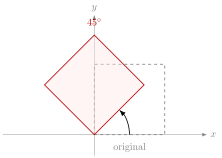

## Sumário {.smaller}

- **20.1** Rotação em $\mathbb{R}^2$
- **20.2** Reflexões em $\mathbb{R}^2$
- **20.3** Escala e cisalhamento
- **20.4** Composição de transformações geométricas
- **20.5** Aplicação: transformando um polígono

# 20.1 — Rotação em $\mathbb{R}^2$

## Matriz de rotação

::: {.callout-note title="Definição"}
A rotação de ângulo $\theta$ (sentido anti-horário), em torno da origem, tem matriz canônica
$$R_\theta = \begin{bmatrix}\cos\theta & -\sin\theta\\ \sin\theta & \cos\theta\end{bmatrix}$$
:::

- Obtida como na Aula 16: $R_\theta e_1 = (\cos\theta,\sin\theta)$, $R_\theta e_2=(-\sin\theta,\cos\theta)$.

## Exemplo — rotação de $90^\circ$

$$R_{90^\circ} = \begin{bmatrix}0&-1\\1&0\end{bmatrix}$$

Aplicando a $v=(2,1)$:
$$R_{90^\circ}v = \begin{bmatrix}0&-1\\1&0\end{bmatrix}\begin{bmatrix}2\\1\end{bmatrix} = \begin{bmatrix}-1\\2\end{bmatrix}$$

## Exemplo — rotação de $45^\circ$

$$R_{45^\circ} = \begin{bmatrix}\tfrac{\sqrt2}{2}&-\tfrac{\sqrt2}{2}\\[4pt]\tfrac{\sqrt2}{2}&\tfrac{\sqrt2}{2}\end{bmatrix}$$

Aplicando a $v=(1,1)$:
$$R_{45^\circ}v = \begin{bmatrix}\tfrac{\sqrt2}{2}&-\tfrac{\sqrt2}{2}\\[4pt]\tfrac{\sqrt2}{2}&\tfrac{\sqrt2}{2}\end{bmatrix}\begin{bmatrix}1\\1\end{bmatrix} = \begin{bmatrix}0\\\sqrt2\end{bmatrix}$$

{fig-align="center" width="45%"}

O quadrado unitário (pontilhado) gira $45^\circ$ e vira o "losango" (contorno colorido); o vértice $(1,1)$ vai para $(0,\sqrt2)$.

# 20.2 — Reflexões em $\mathbb{R}^2$

## As três reflexões — matrizes

::: {.callout-note title="Definição"}
$$\text{eixo } x:\ \begin{bmatrix}1&0\\0&-1\end{bmatrix} \qquad \text{eixo } y:\ \begin{bmatrix}-1&0\\0&1\end{bmatrix} \qquad \text{reta } y=x:\ \begin{bmatrix}0&1\\1&0\end{bmatrix}$$
:::

- Reflexão no eixo $x$: $(x,y)\mapsto(x,-y)$.
- Reflexão no eixo $y$: $(x,y)\mapsto(-x,y)$.
- Reflexão na reta $y=x$: $(x,y)\mapsto(y,x)$.

## Exemplos — aplicando as três reflexões

Para $v=(3,2)$:

$$\begin{bmatrix}1&0\\0&-1\end{bmatrix}\begin{bmatrix}3\\2\end{bmatrix}=\begin{bmatrix}3\\-2\end{bmatrix} \qquad \begin{bmatrix}-1&0\\0&1\end{bmatrix}\begin{bmatrix}3\\2\end{bmatrix}=\begin{bmatrix}-3\\2\end{bmatrix} \qquad \begin{bmatrix}0&1\\1&0\end{bmatrix}\begin{bmatrix}3\\2\end{bmatrix}=\begin{bmatrix}2\\3\end{bmatrix}$$

- Reflexão no eixo $x$: $(3,2)\to(3,-2)$.
- Reflexão no eixo $y$: $(3,2)\to(-3,2)$.
- Reflexão em $y=x$: $(3,2)\to(2,3)$.

# 20.3 — Escala e cisalhamento

## Escala (expansão/contração)

::: {.callout-note title="Definição"}
$$\begin{bmatrix}k_1&0\\0&k_2\end{bmatrix}: \quad (x,y)\mapsto(k_1x,\ k_2y)$$
:::

- $k_i>1$: expansão na direção do eixo; $0<k_i<1$: contração; $k_i<0$: inverte o sentido.

**Exemplo:** $k_1=2$, $k_2=\tfrac12$, aplicado a $v=(4,6)$:
$$\begin{bmatrix}2&0\\0&\tfrac12\end{bmatrix}\begin{bmatrix}4\\6\end{bmatrix}=\begin{bmatrix}8\\3\end{bmatrix}$$

## Cisalhamento (shear)

::: {.callout-note title="Definição"}
Cisalhamento horizontal de fator $k$:
$$\begin{bmatrix}1&k\\0&1\end{bmatrix}: \quad (x,y)\mapsto(x+ky,\ y)$$
:::

**Exemplo:** $k=\tfrac12$, aplicado a $v=(1,1)$:
$$\begin{bmatrix}1&\tfrac12\\0&1\end{bmatrix}\begin{bmatrix}1\\1\end{bmatrix}=\begin{bmatrix}\tfrac32\\1\end{bmatrix}$$

- Retas horizontais permanecem fixas; retas verticais "inclinam" proporcionalmente à altura $y$.

# 20.4 — Composição de transformações geométricas

## Rotação seguida de escala

Seja $T_1=R_{45^\circ}$ e $T_2$ a escala $\begin{bmatrix}2&0\\0&1\end{bmatrix}$ (estica o eixo $x$).

$$[T_2\circ T_1] = [T_2][T_1] = \begin{bmatrix}2&0\\0&1\end{bmatrix}\begin{bmatrix}\tfrac{\sqrt2}{2}&-\tfrac{\sqrt2}{2}\\[4pt]\tfrac{\sqrt2}{2}&\tfrac{\sqrt2}{2}\end{bmatrix} = \begin{bmatrix}\sqrt2&-\sqrt2\\[2pt]\tfrac{\sqrt2}{2}&\tfrac{\sqrt2}{2}\end{bmatrix}$$

Aplicando a $v=(1,0)$: primeiro $T_1(1,0)=\left(\tfrac{\sqrt2}{2},\tfrac{\sqrt2}{2}\right)$ (gira $45^\circ$), depois $T_2\left(\tfrac{\sqrt2}{2},\tfrac{\sqrt2}{2}\right)=\left(\sqrt2,\tfrac{\sqrt2}{2}\right)$ (estica em $x$).

Direto pela matriz composta:
$$\begin{bmatrix}\sqrt2&-\sqrt2\\[2pt]\tfrac{\sqrt2}{2}&\tfrac{\sqrt2}{2}\end{bmatrix}\begin{bmatrix}1\\0\end{bmatrix} = \begin{bmatrix}\sqrt2\\[2pt]\tfrac{\sqrt2}{2}\end{bmatrix} \ \checkmark$$

# 20.5 — Aplicação: transformando um polígono

## Exemplo — triângulo sob rotação de $90^\circ$

Triângulo com vértices $A=(1,0)$, $B=(3,0)$, $C=(1,2)$. Aplicando $R_{90^\circ}:(x,y)\mapsto(-y,x)$:

| Vértice | Antes | Depois de $R_{90^\circ}$ |
|---|---|---|
| $A$ | $(1,0)$ | $(0,1)$ |
| $B$ | $(3,0)$ | $(0,3)$ |
| $C$ | $(1,2)$ | $(-2,1)$ |

- O triângulo gira $90^\circ$ em torno da origem, preservando forma e área (rotações são **isometrias**).

## Exemplo — mesmo triângulo sob reflexão em $y=x$

Aplicando agora a reflexão $(x,y)\mapsto(y,x)$ ao mesmo triângulo original:

| Vértice | Antes | Depois de refletir em $y=x$ |
|---|---|---|
| $A$ | $(1,0)$ | $(0,1)$ |
| $B$ | $(3,0)$ | $(0,3)$ |
| $C$ | $(1,2)$ | $(2,1)$ |

- Note que $A$ e $B$ vão para os **mesmos** pontos que na rotação de $90^\circ$, mas $C$ vai para $(2,1)$, diferente de $(-2,1)$: rotação e reflexão são transformações geometricamente distintas, mesmo coincidindo em alguns pontos.
- Aplicações em computação gráfica: qualquer objeto poligonal é transformado aplicando a matriz a cada vértice individualmente.

## Resumo da aula {.smaller}

- **20.1** — Rotação: $R_\theta=\begin{bmatrix}\cos\theta&-\sin\theta\\\sin\theta&\cos\theta\end{bmatrix}$.
- **20.2** — Reflexões nos eixos $x$, $y$ e na reta $y=x$: três matrizes simples e específicas.
- **20.3** — Escala (matriz diagonal) e cisalhamento (matriz triangular com $1$'s na diagonal).
- **20.4** — Composição de transformações geométricas via produto de matrizes (a ordem importa).
- **20.5** — Transformar um polígono é transformar cada vértice individualmente pela matriz da transformação — base da computação gráfica.

## Referências

- Anton, H.; Rorres, C. **Álgebra Linear com Aplicações**. Capítulo sobre transformações geométricas do plano.
- Lay, D. C. **Álgebra Linear e suas Aplicações**. Seção sobre transformações lineares geométricas.
- Strang, G. **Álgebra Linear e suas Aplicações**. Capítulo sobre transformações e computação gráfica.
