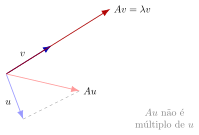

# 21.1 — Autovalores e autovetores

## Motivação: direções que não mudam

{fig-align="center" width="55%"}

- Uma transformação $A$ gira, estica e deforma vetores em geral.
- Mas existem direções **especiais** $v\neq 0$ tais que $Av$ é apenas $v$ esticado ou encolhido: $Av=\lambda v$.
- Para $u$ genérico, $Au$ aponta para uma direção **diferente** de $u$ — não é o caso especial que buscamos.

## Definição — autovalor e autovetor

::: {.callout-note title="Definição"}
Seja $A$ uma matriz $n\times n$. Um escalar $\lambda$ é um **autovalor** de $A$ se existe um vetor $v\neq 0$ em $\mathbb{R}^n$ tal que
$$Av = \lambda v.$$
O vetor $v$ é um **autovetor** de $A$ associado a $\lambda$.
:::

- Geometricamente: $A$ atua sobre $v$ como uma simples multiplicação por escalar.
- Se $|\lambda|>1$: $v$ é esticado. Se $0<|\lambda|<1$: $v$ é encolhido. Se $\lambda<0$: além de escalar, inverte o sentido.

## Equação característica

Reescrevendo $Av=\lambda v$ como $Av-\lambda v = 0$, ou seja, $(A-\lambda I)v=0$:

- Esse sistema homogêneo tem solução **não trivial** $v\neq 0$ se e somente se $A-\lambda I$ **não** é invertível.
- Logo, $\lambda$ é autovalor de $A$ $\iff$ $\det(A-\lambda I)=0$.

::: {.callout-note title="Definição — polinômio e equação característica"}
$\det(A-\lambda I) = 0$ é a **equação característica** de $A$; $\det(A-\lambda I)$, como polinômio em $\lambda$, é o **polinômio característico** de $A$ — tem grau $n$ para $A$ de tamanho $n\times n$.
:::

- Os autovalores de $A$ são exatamente as **raízes** do polinômio característico.
- Para cada autovalor $\lambda$, o **autoespaço** associado é $\ker(A-\lambda I) = \{v : (A-\lambda I)v=0\}$ — sempre um subespaço, de dimensão $\ge 1$.

## Exemplo — matriz $2\times2$ (autovalores)

Seja $A=\begin{bmatrix}4&2\\1&3\end{bmatrix}$. O polinômio característico é
$$\det(A-\lambda I) = \det\begin{bmatrix}4-\lambda&2\\1&3-\lambda\end{bmatrix} = (4-\lambda)(3-\lambda)-2 = \lambda^2-7\lambda+10.$$

Fatorando: $\lambda^2-7\lambda+10=(\lambda-5)(\lambda-2)$.

$$\boxed{\lambda_1=5,\qquad \lambda_2=2}$$

## Exemplo — matriz $2\times2$ (autoespaços)

**Para $\lambda_1=5$:** resolver $(A-5I)v=0$, isto é, $\begin{bmatrix}-1&2\\1&-2\end{bmatrix}v=0$.

Da primeira linha: $-v_1+2v_2=0 \Rightarrow v_1=2v_2$. Autoespaço: $\mathrm{span}\{(2,1)\}$.

**Para $\lambda_2=2$:** resolver $(A-2I)v=0$, isto é, $\begin{bmatrix}2&2\\1&1\end{bmatrix}v=0$.

Da primeira linha: $2v_1+2v_2=0 \Rightarrow v_1=-v_2$. Autoespaço: $\mathrm{span}\{(1,-1)\}$.

$$v_1=(2,1) \text{ associado a } \lambda_1=5, \qquad v_2=(1,-1) \text{ associado a } \lambda_2=2.$$

## Exemplo — matriz $3\times3$ (autovalores)

Seja $A=\begin{bmatrix}2&1&1\\1&2&1\\1&1&2\end{bmatrix}$. O polinômio característico é
$$\det(A-\lambda I) = -\lambda^3+6\lambda^2-9\lambda+4.$$

Igualando a zero e fatorando (raiz $\lambda=4$ e raiz dupla $\lambda=1$):
$$\lambda^3-6\lambda^2+9\lambda-4=(\lambda-4)(\lambda-1)^2=0$$

$$\boxed{\lambda_1=4 \ \ (\text{simples}), \qquad \lambda_2=1 \ \ (\text{dupla})}$$

## Exemplo — matriz $3\times3$ (autoespaços)

**Para $\lambda_1=4$:** $(A-4I)v=0$ com $A-4I=\begin{bmatrix}-2&1&1\\1&-2&1\\1&1&-2\end{bmatrix}$.

Resolvendo o sistema: $v_1=v_2=v_3$. Autoespaço: $\mathrm{span}\{(1,1,1)\}$ — dimensão $1$.

**Para $\lambda_2=1$:** $(A-I)v=0$ com $A-I=\begin{bmatrix}1&1&1\\1&1&1\\1&1&1\end{bmatrix}$.

Resolvendo: apenas $v_1+v_2+v_3=0$. Autoespaço: $\mathrm{span}\{(1,-1,0),(1,0,-1)\}$ — dimensão $2$.

# 21.2 — Multiplicidade e casos especiais

## Multiplicidade algébrica e geométrica

::: {.callout-note title="Definição"}
Seja $\lambda$ autovalor de $A$.

- A **multiplicidade algébrica** de $\lambda$ é a multiplicidade de $\lambda$ como raiz do polinômio característico.
- A **multiplicidade geométrica** de $\lambda$ é $\dim\ker(A-\lambda I)$, a dimensão do autoespaço.
:::

No exemplo anterior: $\lambda_1=4$ tem multiplicidades algébrica e geométrica ambas iguais a $1$; $\lambda_2=1$ tem multiplicidade algébrica $2$ **e** geométrica $2$ — coincidem nos dois casos.

## Teorema 21.1 — relação entre as multiplicidades

::: {.callout-important title="Teorema 21.1"}
Para todo autovalor $\lambda$ de $A$:
$$1 \le (\text{multiplicidade geométrica de }\lambda) \le (\text{multiplicidade algébrica de }\lambda).$$
:::

- Quando a geométrica é **estritamente menor** que a algébrica, dizemos que $A$ é **defectiva** em $\lambda$ — faltam autovetores LI, o que impede a diagonalização (assunto da próxima aula).

## Exemplo — geométrica menor que algébrica

Seja $A=\begin{bmatrix}2&1\\0&2\end{bmatrix}$. Como $A$ é triangular, $\det(A-\lambda I)=(2-\lambda)^2$:

$$\lambda=2 \ \ \text{com multiplicidade algébrica } 2.$$

Autoespaço: $(A-2I)v=0$ com $A-2I=\begin{bmatrix}0&1\\0&0\end{bmatrix}$, ou seja, $v_2=0$ e $v_1$ livre.

$$\ker(A-2I) = \mathrm{span}\{(1,0)\} \ \Rightarrow \ \text{multiplicidade geométrica } =1 < 2.$$

::: {.callout-tip title="Observação"}
Só há **um** autovetor LI para $\lambda=2$ (a menos de múltiplo escalar) — não há autovetores suficientes para formar uma base de $\mathbb{R}^2$.
:::

## Teorema 21.2 — autovalores de matrizes triangulares

::: {.callout-important title="Teorema 21.2"}
Se $A$ é uma matriz triangular (superior, inferior ou diagonal), então os autovalores de $A$ são exatamente as entradas de sua diagonal principal.
:::

**Exemplo:** para $A=\begin{bmatrix}1&1&1\\0&2&1\\0&0&3\end{bmatrix}$, como $A$ é triangular superior,
$$\det(A-\lambda I) = (1-\lambda)(2-\lambda)(3-\lambda) \ \Rightarrow \ \lambda_1=1,\ \lambda_2=2,\ \lambda_3=3.$$

Nenhum cálculo adicional é necessário — basta ler a diagonal.

## Resumo da aula

- Autovalor/autovetor: $Av=\lambda v$, $v\neq 0$ — direções que a transformação apenas escala.
- Autovalores = raízes do polinômio característico $\det(A-\lambda I)$; autoespaço = $\ker(A-\lambda I)$.
- Exemplos completos $2\times2$ e $3\times3$: cálculo de polinômio característico, raízes e autoespaços.
- Multiplicidade algébrica $\ge$ multiplicidade geométrica $\ge 1$; quando desigual, a matriz é defectiva.
- Caso especial: autovalores de matriz triangular = entradas da diagonal.

## Referências

- Anton, H. & Rorres, C. **Álgebra Linear com Aplicações**. 10ª ed. Bookman.
- Lay, D. C. **Álgebra Linear e suas Aplicações**. 4ª ed. Pearson.
- Strang, G. **Introdução à Álgebra Linear**. 4ª ed. LTC.
- Larson, R. **Elementos de Álgebra Linear**, 8ª ed. Capítulo sobre Autovalores e Autovetores.
