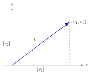
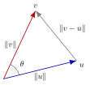
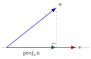

# 5.1 — Comprimento e produto escalar em $\mathbb{R}^n$

## Da geometria para $\mathbb{R}^n$

- Em $\mathbb{R}^2$, um vetor é caracterizado por **comprimento** e **direção**.
- Queremos estender comprimento, distância e ângulo de $\mathbb{R}^2$ para $\mathbb{R}^n$.
- Ferramenta central: o **produto escalar**.

## Comprimento (norma) de um vetor

{fig-align="center" width="45%"}

Pelo Teorema de Pitágoras em $\mathbb{R}^2$: $\|v\|^2 = v_1^2+v_2^2$.

::: {.callout-note title="Definição"}
O comprimento, ou **norma**, de $v=(v_1,v_2,\dots,v_n)\in\mathbb{R}^n$ é
$$\|v\| = \sqrt{v_1^2+v_2^2+\cdots+v_n^2}.$$
Se $\|v\|=1$, $v$ é um **vetor unitário**.
:::

## Exemplo — comprimento de um vetor

**a.** Em $\mathbb{R}^5$, para $v=(0,-2,1,4,-2)$:
$$\|v\|=\sqrt{0^2+(-2)^2+1^2+4^2+(-2)^2}=\sqrt{25}=5.$$

**b.** Em $\mathbb{R}^3$, para $v=\left(\tfrac{2}{\sqrt{17}},-\tfrac{2}{\sqrt{17}},\tfrac{3}{\sqrt{17}}\right)$, tem-se $\|v\|=1$: um **vetor unitário**.

- Vetores unitários canônicos: $\{i,j\}$ em $\mathbb{R}^2$, $\{i,j,k\}$ em $\mathbb{R}^3$.
- $u,v$ não nulos são **paralelos** quando $u=cv$ para algum escalar $c$.

## Normalização de um vetor

::: {.callout-important title="Teorema 5.1 — comprimento de um múltiplo escalar"}
$\|cv\| = |c|\,\|v\|$
:::

::: {.callout-important title="Teorema 5.2 — vetor unitário na direção de $v$"}
Se $v\neq 0$ em $\mathbb{R}^n$, então $u = \dfrac{v}{\|v\|}$ tem comprimento $1$ e a mesma direção de $v$.
:::

**Exemplo:** o vetor unitário na direção de $v=(3,-1,2)$ é
$$\frac{v}{\|v\|}=\frac{1}{\sqrt{14}}(3,-1,2)=\left(\tfrac{3}{\sqrt{14}},-\tfrac{1}{\sqrt{14}},\tfrac{2}{\sqrt{14}}\right).$$

## Distância entre dois vetores

::: {.callout-note title="Definição"}
A distância entre $u$ e $v$ em $\mathbb{R}^n$ é
$$d(u,v) = \|u-v\|.$$
:::

Propriedades: $d(u,v)\ge 0$; $d(u,v)=0 \iff u=v$; $d(u,v)=d(v,u)$.

**Exemplo:** para $u=(-1,-4)$, $v=(2,3)$:
$$d(u,v)=\|(-3,-7)\|=\sqrt{9+49}=\sqrt{58}.$$

## Produto escalar e ângulo entre vetores

{fig-align="center" width="34%"}

Pela lei dos cossenos, $\|v-u\|^2 = \|u\|^2+\|v\|^2-2\|u\|\|v\|\cos\theta$, o que leva a $\cos\theta = \dfrac{u_1v_1+u_2v_2}{\|u\|\,\|v\|}$.

## Produto escalar em $\mathbb{R}^n$

::: {.callout-note title="Definição"}
$$u\cdot v = u_1v_1+u_2v_2+\cdots+u_nv_n$$
:::

::: {.callout-important title="Teorema 5.3 — propriedades do produto escalar"}
Para $u,v,w\in\mathbb{R}^n$ e escalar $c$:

1. $u\cdot v = v\cdot u$
2. $u\cdot(v+w)=u\cdot v+u\cdot w$
3. $c(u\cdot v) = (cu)\cdot v = u\cdot(cv)$
4. $v\cdot v = \|v\|^2$
5. $v\cdot v\ge 0$, com igualdade sse $v=0$
:::

## Exemplos — produto escalar

Para $u=(2,-2)$, $v=(5,8)$, $w=(-4,3)$:

- $u\cdot v = 2(5)+(-2)(8) = -6$
- $(u\cdot v)w = -6(-4,3)=(24,-18)$
- $u\cdot(2v)=2(u\cdot v)=-12$
- $\|w\|^2 = w\cdot w = 25$

**Usando propriedades:** se $u\cdot u=39$, $u\cdot v=-3$, $v\cdot v=79$, então
$$(u+2v)\cdot(3u+v)=3(u\cdot u)+7(u\cdot v)+2(v\cdot v)=3(39)+7(-3)+2(79)=254.$$

## Desigualdade de Cauchy-Schwarz

::: {.callout-important title="Teorema 5.4"}
Para $u,v\in\mathbb{R}^n$:
$$|u\cdot v| \le \|u\|\,\|v\|$$
:::

- Essencial para que $\cos\theta = \dfrac{u\cdot v}{\|u\|\|v\|}$ faça sentido (o lado direito precisa estar em $[-1,1]$).

**Exemplo:** $u=(1,-1,3)$, $v=(2,0,-1)$: $|u\cdot v|=1 \le \|u\|\|v\|=\sqrt{55}$. ✓

## Ângulo e ortogonalidade

::: {.callout-note title="Definição — ângulo entre vetores"}
$$\cos\theta = \frac{u\cdot v}{\|u\|\,\|v\|}, \qquad 0\le\theta\le\pi$$
:::

::: {.callout-note title="Definição — vetores ortogonais"}
$u$ e $v$ são **ortogonais** quando $u\cdot v = 0$. (O vetor nulo é ortogonal a todo vetor.)
:::

**Exemplo:** $u=(1,0,0)$ e $v=(0,1,0)$ são ortogonais, pois $u\cdot v=0$.

**Exemplo:** todo vetor ortogonal a $u=(4,2)$ tem a forma $v=t(1,-2)$.

## Desigualdade triangular e Pitágoras

::: {.callout-important title="Teorema 5.5 — desigualdade triangular"}
$$\|u+v\| \le \|u\|+\|v\|$$
:::

::: {.callout-important title="Teorema 5.6 — Teorema de Pitágoras"}
$u$ e $v$ são ortogonais $\iff$
$$\|u+v\|^2 = \|u\|^2+\|v\|^2$$
:::

Ambos seguem diretamente de Cauchy-Schwarz e das propriedades do produto escalar.

## Produto escalar via multiplicação de matrizes

Escrevendo $u,v$ como matrizes coluna $n\times 1$:
$$u\cdot v = u^Tv = [u_1\ u_2\ \cdots\ u_n]\begin{bmatrix}v_1\\v_2\\\vdots\\v_n\end{bmatrix}$$

**Exemplo:** $u=\begin{bmatrix}1\\2\\-1\end{bmatrix}$, $v=\begin{bmatrix}3\\-2\\4\end{bmatrix}$:
$$u^Tv = [1\ \ 2\ \ {-1}]\begin{bmatrix}3\\-2\\4\end{bmatrix} = 3-4-4=-5.$$

# 5.2 — Espaços com produto interno

## Generalizando o produto escalar

- O produto escalar é **um exemplo** de produto interno — o *produto interno euclidiano*.
- Notação: $u\cdot v$ (euclidiano) vs. $\langle u,v\rangle$ (produto interno geral).
- Um espaço vetorial $V$ munido de um produto interno é um **espaço com produto interno**.

## Definição de produto interno

::: {.callout-note title="Definição"}
Um produto interno em $V$ associa a cada par $u,v$ um escalar $\langle u,v\rangle$ satisfazendo, para todo $u,v,w\in V$ e escalar $c$:

1. $\langle u,v\rangle = \langle v,u\rangle$
2. $\langle u,v+w\rangle = \langle u,v\rangle+\langle u,w\rangle$
3. $c\langle u,v\rangle = \langle cu,v\rangle$
4. $\langle v,v\rangle \ge 0$, com igualdade sse $v=0$
:::

Estes axiomas seguem as propriedades 1, 2, 3 e 5 do Teorema 5.3.

## Exemplo — produto interno euclidiano

O produto escalar usual em $\mathbb{R}^n$ satisfaz os quatro axiomas (Teorema 5.3) e é, portanto, um produto interno em $\mathbb{R}^n$.

Mas **não é o único**: em $\mathbb{R}^2$, com $u=(u_1,u_2)$, $v=(v_1,v_2)$,
$$\langle u,v\rangle = u_1v_1+2u_2v_2$$
também define um produto interno (verificam-se os quatro axiomas diretamente).

## Produtos internos ponderados

De modo geral, para constantes positivas $c_1,\dots,c_n$:
$$\langle u,v\rangle = c_1u_1v_1+c_2u_2v_2+\cdots+c_nu_nv_n$$
é um produto interno em $\mathbb{R}^n$ — os $c_i$ são **pesos**.

::: {.callout-tip title="Contraexemplo"}
$\langle u,v\rangle = u_1v_1-2u_2v_2+u_3v_3$ **não** é produto interno em $\mathbb{R}^3$: para $v=(1,2,1)$, $\langle v,v\rangle = 1-8+1=-6<0$, violando o Axioma 4.
:::

## Produto interno em espaços de matrizes

Para $A,B \in M_{2,2}$:
$$\langle A,B\rangle = a_{11}b_{11}+a_{12}b_{12}+a_{21}b_{21}+a_{22}b_{22}$$
define um produto interno em $M_{2,2}$ (os quatro axiomas se verificam de modo análogo ao caso de $\mathbb{R}^4$).

::: {.callout-important title="Teorema 5.7 — propriedades"}
Em qualquer espaço com produto interno $V$: $\langle 0,v\rangle=0$; $\langle u+v,w\rangle=\langle u,w\rangle+\langle v,w\rangle$; $\langle u,cv\rangle = c\langle u,v\rangle$.
:::

## Comprimento, distância e ângulo — versão geral

::: {.callout-note title="Definições em um espaço com produto interno $V$"}
1. Comprimento: $\|u\| = \sqrt{\langle u,u\rangle}$
2. Distância: $d(u,v) = \|u-v\|$
3. Ângulo: $\cos\theta = \dfrac{\langle u,v\rangle}{\|u\|\,\|v\|}$, $0\le\theta\le\pi$
4. Ortogonalidade: $u\perp v \iff \langle u,v\rangle=0$
:::

::: {.callout-important title="Teorema 5.8 — versões gerais"}
Cauchy-Schwarz $|\langle u,v\rangle|\le\|u\|\|v\|$; desigualdade triangular $\|u+v\|\le\|u\|+\|v\|$; Pitágoras: $u\perp v \iff \|u+v\|^2=\|u\|^2+\|v\|^2$.
:::

## Projeção ortogonal — motivação

{fig-align="center" width="42%"}

Projetar $u$ ortogonalmente em $v\neq 0$: $\mathrm{proj}_v u = av$ para algum escalar $a$.

## Projeção ortogonal — definição

::: {.callout-note title="Definição"}
Em um espaço com produto interno $V$, com $v\neq 0$:
$$\mathrm{proj}_v u = \frac{\langle u,v\rangle}{\langle v,v\rangle}\,v$$
:::

**Exemplo (em $\mathbb{R}^2$):** $u=(4,2)$, $v=(3,4)$:
$$\mathrm{proj}_v u = \frac{u\cdot v}{v\cdot v}v = \frac{20}{25}(3,4) = \left(\tfrac{12}{5},\tfrac{16}{5}\right).$$

**Exemplo (em $\mathbb{R}^3$):** $u=(6,2,4)$, $v=(1,2,0)$: $u\cdot v=10$, $v\cdot v=5$,
$$\mathrm{proj}_v u = 2(1,2,0) = (2,4,0).$$

## A projeção é a melhor aproximação

::: {.callout-important title="Teorema 5.9"}
Sejam $u,v$ em um espaço com produto interno, $v\neq 0$. Então, entre **todos** os múltiplos escalares $cv$,
$$d(u,\mathrm{proj}_v u) < d(u,cv), \qquad c\neq \frac{\langle u,v\rangle}{\langle v,v\rangle}.$$
:::

- Ou seja: $\mathrm{proj}_v u$ é o ponto da reta $\mathrm{span}\{v\}$ mais próximo de $u$.
- Além disso, $u - \mathrm{proj}_v u$ é sempre ortogonal a $v$.

## Resumo da aula

- **5.1** — Norma, distância, ângulo e ortogonalidade em $\mathbb{R}^n$ via produto escalar; Cauchy-Schwarz, desigualdade triangular, Pitágoras.
- **5.2** — Produto interno geral (axiomas); mesmas noções geométricas (comprimento, distância, ângulo, ortogonalidade) em qualquer espaço vetorial; projeção ortogonal como melhor aproximação sobre uma reta.

## Referências

- Larson, R. **Elementos de Álgebra Linear**, 8ª edição. Capítulo 5 — Espaços com Produto Interno (Seções 5.1 e 5.2).
- Anton, H. & Rorres, C. **Álgebra Linear com Aplicações**. 10ª ed. Bookman.
- Lay, D. C. **Álgebra Linear e suas Aplicações**. 4ª ed. Pearson.
- Strang, G. **Introdução à Álgebra Linear**. 4ª ed. LTC.
