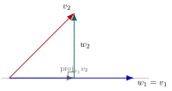

# 5.3 — Bases ortonormais: Gram-Schmidt

## Por que bases ortonormais?

- Um espaço vetorial admite muitas bases — algumas mais convenientes que outras.
- A base canônica de $\mathbb{R}^3$ é especial: os vetores são **mutuamente ortogonais** e **unitários**.

::: {.callout-note title="Definições"}
Um conjunto $S=\{v_1,\dots,v_n\}$ é:

- **ortogonal** quando $\langle v_i,v_j\rangle = 0$ para $i\neq j$;
- **ortonormal** quando, além disso, $\|v_i\|=1$ para todo $i$.
:::

## Exemplo — base ortonormal não canônica de $\mathbb{R}^3$

$$S=\left\{\left(\tfrac{1}{\sqrt2},\tfrac{1}{\sqrt2},0\right),\ \left(-\tfrac{1}{\sqrt{18}},\tfrac{1}{\sqrt{18}},\tfrac{4}{\sqrt{18}}\right),\ \left(\tfrac{2}{3},-\tfrac{2}{3},\tfrac13\right)\right\}$$

Verificando: $v_1\cdot v_2 = v_1\cdot v_3 = v_2\cdot v_3 = 0$ e $\|v_1\|=\|v_2\|=\|v_3\|=1$.

- Os três vetores não são coplanares $\Rightarrow$ geram $\mathbb{R}^3$ $\Rightarrow$ formam base ortonormal.

## Conjuntos ortogonais são LI

::: {.callout-important title="Teorema 5.10"}
Se $S=\{v_1,\dots,v_n\}$ é um conjunto ortogonal de vetores **não nulos**, então $S$ é linearmente independente.

**Corolário:** em um espaço de dimensão $n$, qualquer conjunto ortogonal de $n$ vetores não nulos é uma base.
:::

**Exemplo:** para verificar que $S=\{v_1,v_2,v_3,v_4\}\subset\mathbb{R}^4$ é base, basta checar que os 6 produtos escalares $v_i\cdot v_j$ ($i\neq j$) são todos zero — não é necessário calcular determinante ou escalonar!

## Coordenadas em base ortonormal

::: {.callout-important title="Teorema 5.11 — coeficientes de Fourier"}
Se $B=\{v_1,\dots,v_n\}$ é base ortonormal de $V$, então todo $w\in V$ se escreve
$$w = \langle w,v_1\rangle v_1+\langle w,v_2\rangle v_2+\cdots+\langle w,v_n\rangle v_n.$$
:::

- **Vantagem enorme:** as coordenadas $c_i=\langle w,v_i\rangle$ são obtidas por produtos internos — sem resolver sistema linear!

**Exemplo:** $w=(5,-5,2)$ na base ortonormal $B=\{(\tfrac35,\tfrac45,0),(-\tfrac45,\tfrac35,0),(0,0,1)\}$:
$$[w]_B = [\,w\cdot v_1\ \ w\cdot v_2\ \ w\cdot v_3\,]^T = [-1\ \ -7\ \ 2]^T.$$

## O processo de Gram-Schmidt

**Ideia geométrica em $\mathbb{R}^2$:**

{fig-align="center" width="45%"}

$$w_1=v_1, \qquad w_2 = v_2-\mathrm{proj}_{w_1}v_2$$

$w_2$ é, por construção, ortogonal a $w_1$.

## Processo de Gram-Schmidt — algoritmo geral

::: {.callout-important title="Teorema 5.12"}
Seja $B=\{v_1,\dots,v_n\}$ base de $V$. Defina
$$w_1=v_1,\quad w_2 = v_2-\frac{\langle v_2,w_1\rangle}{\langle w_1,w_1\rangle}w_1,\quad w_3 = v_3-\frac{\langle v_3,w_1\rangle}{\langle w_1,w_1\rangle}w_1-\frac{\langle v_3,w_2\rangle}{\langle w_2,w_2\rangle}w_2,\ \ldots$$
Então $B'=\{w_1,\dots,w_n\}$ é base **ortogonal**; normalizando, $u_i=w_i/\|w_i\|$, obtemos base **ortonormal** $B''$.
:::

**Passos:** (1) partir de uma base qualquer; (2) ortogonalizar subtraindo projeções; (3) normalizar.

## Exemplo — Gram-Schmidt em $\mathbb{R}^2$

Para $B=\{(1,1),(0,1)\}$:

$$w_1=(1,1), \qquad w_2 = (0,1)-\tfrac12(1,1) = \left(-\tfrac12,\tfrac12\right)$$

Normalizando:
$$u_1 = \left(\tfrac{\sqrt2}{2},\tfrac{\sqrt2}{2}\right), \qquad u_2 = \left(-\tfrac{\sqrt2}{2},\tfrac{\sqrt2}{2}\right)$$

$B''=\{u_1,u_2\}$ é base ortonormal de $\mathbb{R}^2$.

## Exemplo — Gram-Schmidt em $\mathbb{R}^3$

Para $B=\{(1,1,0),(1,2,0),(0,1,2)\}$:

$$w_1=(1,1,0)$$
$$w_2 = (1,2,0)-\tfrac32(1,1,0) = \left(-\tfrac12,\tfrac12,0\right)$$
$$w_3 = (0,1,2)-\tfrac12(1,1,0)-1\left(-\tfrac12,\tfrac12,0\right) = (0,0,2)$$

Normalizando: $u_1=\left(\tfrac{\sqrt2}2,\tfrac{\sqrt2}2,0\right)$, $u_2=\left(-\tfrac{\sqrt2}2,\tfrac{\sqrt2}2,0\right)$, $u_3=(0,0,1)$.

## Gram-Schmidt em um subespaço

O processo funciona igualmente em **subespaços**. Para $v_1=(0,1,0)$, $v_2=(1,1,1)$ gerando um plano em $\mathbb{R}^3$:

$$w_1=(0,1,0), \qquad w_2 = (1,1,1)-1\cdot(0,1,0) = (1,0,1)$$

$$u_1=(0,1,0), \qquad u_2 = \left(\tfrac{\sqrt2}2,0,\tfrac{\sqrt2}2\right)$$

$\{u_1,u_2\}$: base ortonormal do plano $\mathrm{span}\{v_1,v_2\}$.

## Forma alternativa do processo

Normalizando a cada passo (em vez de só no final):

$$u_1=\frac{v_1}{\|v_1\|}, \qquad u_2 = \frac{w_2}{\|w_2\|},\ \text{onde } w_2=v_2-\langle v_2,u_1\rangle u_1,\ \ldots$$

**Aplicação:** encontrar base ortonormal do espaço-solução de um sistema homogêneo — primeiro resolve-se o sistema (obtendo uma base qualquer), depois aplica-se Gram-Schmidt.

Exemplo: solução geral $s(-2,2,1,0)+t(1,-8,0,1)$ $\to$ base ortonormal $\{u_1,u_2\}$ do espaço-solução via a forma alternativa.

## Resumo da aula

- Conjuntos ortogonais não nulos são LI; em um espaço de dimensão $n$, $n$ vetores ortogonais não nulos já formam base.
- Em base ortonormal, as coordenadas de qualquer vetor são obtidas por produtos internos (coeficientes de Fourier) — sem resolver sistemas.
- Processo de Gram-Schmidt: transforma qualquer base em base ortogonal (e, normalizando, ortonormal), subtraindo projeções sucessivas.
- O processo se aplica igualmente a subespaços, incluindo espaços-solução de sistemas homogêneos.

## Referências

- Larson, R. **Elementos de Álgebra Linear**, 8ª edição. Capítulo 5 — Espaços com Produto Interno (Seção 5.3).
- Anton, H. & Rorres, C. **Álgebra Linear com Aplicações**. 10ª ed. Bookman.
- Lay, D. C. **Álgebra Linear e suas Aplicações**. 4ª ed. Pearson.
- Strang, G. **Introdução à Álgebra Linear**. 4ª ed. LTC.
