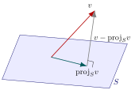
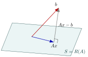

# 5.4 — Subespaços ortogonais e mínimos quadrados

## O problema dos mínimos quadrados

- Sistemas $Ax=b$ **inconsistentes** aparecem, por exemplo, ao ajustar uma reta a pontos não colineares.
- Não existe $x$ com $Ax=b$ exato — buscamos o $x$ que **minimiza** o erro.

::: {.callout-note title="Definição"}
Dada $A$ ($m\times n$) e $b\in\mathbb{R}^m$, o **problema dos mínimos quadrados** é encontrar $x\in\mathbb{R}^n$ que minimiza
$$\|Ax-b\|^2.$$
:::

## Subespaços ortogonais

::: {.callout-note title="Definição"}
$S_1,S_2\subset\mathbb{R}^n$ são **ortogonais** quando $v_1\cdot v_2=0$ para todo $v_1\in S_1$, $v_2\in S_2$.
:::

**Exemplo:** $S_1=\mathrm{span}\{(1,0,1),(1,1,0)\}$ e $S_2=\mathrm{span}\{(-1,1,1)\}$ são ortogonais — todo produto escalar cruzado se anula.

- A interseção de subespaços ortogonais é sempre $\{0\}$.

## Complemento ortogonal

::: {.callout-note title="Definição"}
$$S^{\perp} = \{u\in\mathbb{R}^n : v\cdot u = 0 \ \ \forall v\in S\}$$
:::

**Exemplo:** para $S=\mathrm{span}\{v_1,v_2\}$, colunas de $A$, tem-se $S^\perp = N(A^T)$ (núcleo de $A^T$) — resolve-se $A^Tu=0$.

::: {.callout-note title="Definição — soma direta"}
$\mathbb{R}^n = S_1\oplus S_2$ quando todo $x$ se escreve de modo **único** como $x=s_1+s_2$, $s_1\in S_1$, $s_2\in S_2$.
:::

## Propriedades dos subespaços ortogonais

::: {.callout-important title="Teorema 5.13"}
Seja $S$ subespaço de $\mathbb{R}^n$. Então:

1. $\dim(S)+\dim(S^\perp) = n$
2. $\mathbb{R}^n = S\oplus S^\perp$
3. $(S^\perp)^\perp = S$
:::

Assim, todo vetor $v\in\mathbb{R}^n$ se decompõe unicamente como $v=v_1+v_2$, com $v_1\in S$, $v_2\in S^\perp$.

## Projeção ortogonal em um subespaço

{fig-align="center" width="42%"}

$v_1=\mathrm{proj}_S v$ é a componente de $v$ dentro de $S$; $v-\mathrm{proj}_S v \in S^\perp$.

## Projeção em subespaço — fórmula e exemplo

::: {.callout-important title="Teorema 5.14"}
Se $\{u_1,\dots,u_t\}$ é base ortonormal de $S$, então
$$\mathrm{proj}_S v = (v\cdot u_1)u_1+\cdots+(v\cdot u_t)u_t.$$
:::

**Exemplo:** $v=(1,1,3)$, $S=\mathrm{span}\{(0,3,1),(2,0,0)\}$. Base ortonormal de $S$: $u_1=\left(0,\tfrac{3}{\sqrt{10}},\tfrac1{\sqrt{10}}\right)$, $u_2=(1,0,0)$.
$$\mathrm{proj}_S v = \left(1,\ \tfrac95,\ \tfrac35\right)$$

## A projeção em $S$ é a melhor aproximação

::: {.callout-important title="Teorema 5.15"}
Para $S$ subespaço de $\mathbb{R}^n$, $v\in\mathbb{R}^n$ e $u\in S$ com $u\neq\mathrm{proj}_Sv$:
$$\|v-\mathrm{proj}_S v\| < \|v-u\|$$
:::

- Entre **todos** os vetores de $S$, $\mathrm{proj}_S v$ é o mais próximo de $v$.
- Base da ideia de mínimos quadrados: aproximar $b$ pelo vetor mais próximo dentro de $R(A)$.

## Subespaços fundamentais de uma matriz

Para $A$ de tamanho $m\times n$:

| Subespaço | Descrição | Vive em |
|---|---|---|
| $N(A)$ | núcleo de $A$ | $\mathbb{R}^n$ |
| $R(A^T)$ | espaço-linha de $A$ | $\mathbb{R}^n$ |
| $N(A^T)$ | núcleo de $A^T$ | $\mathbb{R}^m$ |
| $R(A)$ | espaço-coluna de $A$ | $\mathbb{R}^m$ |

::: {.callout-important title="Teorema 5.16"}
$R(A)\perp N(A^T)$, $\ R(A^T)\perp N(A)$, $\ R(A)\oplus N(A^T)=\mathbb{R}^m$, $\ R(A^T)\oplus N(A)=\mathbb{R}^n$.
:::

## Resolvendo o problema dos mínimos quadrados

{fig-align="center" width="28%"}

Queremos $Ax\in S=R(A)$ o mais próximo possível de $b$, isto é, $Ax=\mathrm{proj}_Sb$.

## As equações normais

- $Ax=\mathrm{proj}_Sb$ implica $Ax-b\in S^\perp=N(A^T)$, ou seja, $A^T(Ax-b)=0$.
- Isso equivale a resolver o sistema $n\times n$:

$$A^TA\,x = A^Tb \qquad \text{(equações normais)}$$

- Sempre consistente; solução única quando $\mathrm{posto}(A)=n$.

## Exemplo — reta de mínimos quadrados

Ajustar $y=c_0+c_1x$ aos pontos $(1,0),(2,1),(3,3)$:
$$A=\begin{bmatrix}1&1\\1&2\\1&3\end{bmatrix},\quad b=\begin{bmatrix}0\\1\\3\end{bmatrix}$$

Equações normais: $A^TA=\begin{bmatrix}3&6\\6&14\end{bmatrix}$, $A^Tb=\begin{bmatrix}4\\11\end{bmatrix}$

$$\begin{bmatrix}3&6\\6&14\end{bmatrix}\begin{bmatrix}c_0\\c_1\end{bmatrix}=\begin{bmatrix}4\\11\end{bmatrix} \ \Longrightarrow\ x=\left(-\tfrac53,\ \tfrac32\right)$$

Reta: $y=-\tfrac53+\tfrac32x$.

## Exemplo — projeção via equações normais

Projetar $b=(1,1,3)$ no espaço-coluna $S$ de $A=\begin{bmatrix}0&1\\3&2\\1&0\end{bmatrix}$ (mesmo $S$ do exemplo anterior).

$$A^TA=\begin{bmatrix}10&0\\0&4\end{bmatrix},\quad A^Tb=\begin{bmatrix}6\\2\end{bmatrix}\ \Rightarrow\ x=\left(\tfrac35,\ \tfrac12\right)$$

$$Ax = \left(1,\ \tfrac95,\ \tfrac35\right) = \mathrm{proj}_S b$$

Confere exatamente com o resultado obtido via Teorema 5.14.

## Resumo da aula

- Subespaços ortogonais, complemento ortogonal $S^\perp$ e decomposição $\mathbb{R}^n=S\oplus S^\perp$.
- Projeção em subespaço via base ortonormal: $\mathrm{proj}_Sv=\sum(v\cdot u_i)u_i$ — é a melhor aproximação de $v$ dentro de $S$.
- Subespaços fundamentais de $A$: $N(A)$, $R(A^T)$, $N(A^T)$, $R(A)$ e suas relações de ortogonalidade.
- Mínimos quadrados: equações normais $A^TAx=A^Tb$ resolvem $\min\|Ax-b\|^2$ — aplicado ao ajuste de retas e à projeção em subespaços.

# Encerramento do curso

## Panorama geral da Álgebra Linear

```{mermaid}
%%| fig-width: 10
flowchart TB
    A["Sistemas Lineares e Matrizes<br>(escalonamento, operações, inversas)"] --> B["Espaços Vetoriais<br>(subespaços, base, dimensão)"]
    B --> C["Transformações Lineares<br>(núcleo, imagem, matriz associada)"]
    C --> D["Autovalores e Autovetores<br>(diagonalização, aplicações)"]
    D --> E["Espaços com Produto Interno<br>(ortogonalidade, Gram-Schmidt,<br>mínimos quadrados)"]
    E -.->|"mesma linguagem: vetores,<br>combinações lineares, matrizes"| A
```

- Os quatro grandes blocos do curso não são independentes: cada um fornece a linguagem e as ferramentas para o seguinte.
- Autovalores usam produto interno (ortogonalidade dos autovetores de matrizes simétricas); mínimos quadrados usa transformações lineares e subespaços.

## {data-background-color="#f0f0f0" .v-center-container}

::: {layout-align="center" style="text-align: center;"}
{width=250px}

<br>

### Prof. Dr. Raphael Teixeira

<br>

**Obrigado a todos pela participação e dedicação ao longo do curso!**
:::

## Referências bibliográficas gerais do curso

::: {.columns}

::: {.column width="50%"}
### Básica
- **Anton, H. & Rorres, C.** *Álgebra Linear com Aplicações*. 10ª ed. Bookman.
- **Lay, D. C.** *Álgebra Linear e suas Aplicações*. 4ª ed. Pearson.
- **Strang, G.** *Introdução à Álgebra Linear*. 4ª ed. LTC.
- **Larson, R.** *Elementos de Álgebra Linear*. 8ª ed. (Capítulo 5 — Espaços com Produto Interno).
:::

::: {.column width="50%"}
### Complementar
- **Boldrini, J. L. et al.** *Álgebra Linear*. 3ª ed. Harper & Row do Brasil.
- **Lipschutz, S. & Lipson, M.** *Álgebra Linear*. Coleção Schaum. Bookman.
:::

:::
